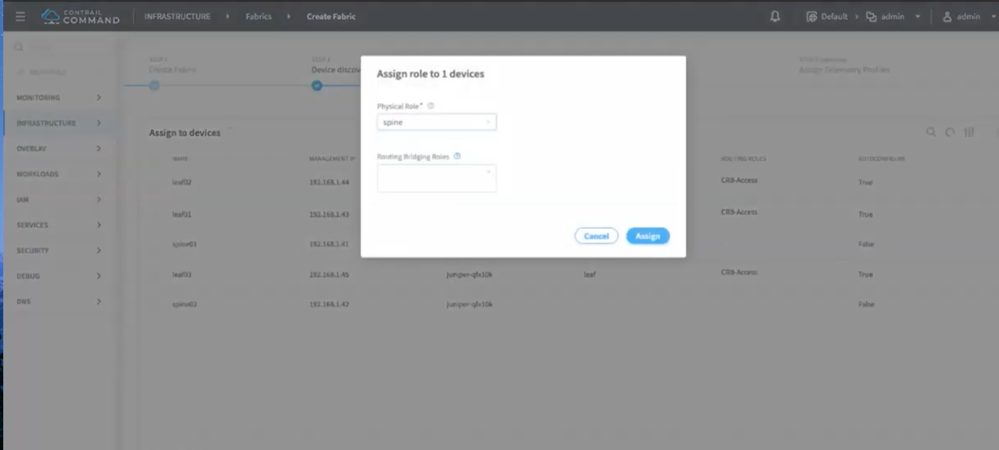

# Contrail Fabric Management 

## Brownfield Onboarding/Discovery/Provisioning using Contrail Command "SDN Controller GUI"

Contrail has a new GUI called contrail Command that allows you , not only to manage virtual networking and virtual workloads, but also to manage your DC IP Fabric. Typically, DataCenter fall into the provisionig challenges of IP Fabric when they expand their DC's over time.  Contrail takes care of this pain by discovering, provisioning and managing the IP Fabric with ease and scale. Contrail can help provision IP Fabrics for both greenfield and brownfield environments.

In green field, fabric nodes have a zeroized configuration and dhcp must be active on management port. Command will act as dhcp and tftp server and will perform ZTP on all the fabric nodes. As a result, all the switches will be configured as part of an IP Fabric.

In a brownfield approach, command expects the IP Fabric nodes to have the underlay configured. It will connect to devices via management network (netconf) and configure the overlay. 

**"Due to lab limitations (dhcp collisions between lab dhcp and command dhcp) I did browfield scenerio"**

---
If you would like to skip and like watching this in video, follow the below the two links

[ Part 01 - CFM Discovery/Onboarding/Provisioning (Brownfield)](https://youtu.be/OlXaK7jSD_U)

[Part 02 - CFM Fabric Deletion](https://youtu.be/-6HUY9rpjfc)

---

# Lab-Topology

The lab is built in EVE-NG, utilizing vQFX images available from Juniper website. The version for vQFX is 17.4R1.16

Below are the brownfield pre-condigured fabric for leaf/spine nodes. 

Spine01 - Config
~~~~~
set groups bf_underlay system services netconf ssh
set groups bf_underlay interfaces xe-0/0/0 mtu 9192
set groups bf_underlay interfaces xe-0/0/0 unit 0 family inet address 192.168.10.1/31
set groups bf_underlay interfaces xe-0/0/1 mtu 9192
set groups bf_underlay interfaces xe-0/0/1 unit 0 family inet address 192.168.30.1/31
set groups bf_underlay interfaces xe-0/0/2 mtu 9192
set groups bf_underlay interfaces xe-0/0/2 unit 0 family inet address 192.168.50.1/31
set groups bf_underlay interfaces lo0 unit 0 family inet address 40.40.40.1/32
set groups bf_underlay routing-options router-id 40.40.40.1
set groups bf_underlay routing-options autonomous-system 65100
set groups bf_underlay routing-options forwarding-table export lb
set groups bf_underlay protocols bgp group underlay type external
set groups bf_underlay protocols bgp group underlay export exp-dir
set groups bf_underlay protocols bgp group underlay local-as 65511
set groups bf_underlay protocols bgp group underlay multipath multiple-as
set groups bf_underlay protocols bgp group underlay neighbor 192.168.10.0 peer-as 65501
set groups bf_underlay protocols bgp group underlay neighbor 192.168.30.0 peer-as 65502
set groups bf_underlay protocols bgp group underlay neighbor 192.168.50.0 peer-as 65503
set groups bf_underlay protocols lldp interface all
set groups bf_underlay policy-options policy-statement lb then load-balance per-packet
set groups bf_underlay policy-options policy-statement exp-dir term lo0 from protocol direct
set groups bf_underlay policy-options policy-statement exp-dir term lo0 from interface lo0.0
set groups bf_underlay policy-options policy-statement exp-dir term lo0 then community set spine
set groups bf_underlay policy-options policy-statement exp-dir term lo0 then accept
set groups bf_underlay policy-options policy-statement exp-dir term leaf from as-path single
set groups bf_underlay policy-options policy-statement exp-dir term leaf from community leaf
set groups bf_underlay policy-options policy-statement exp-dir term leaf then accept
set groups bf_underlay policy-options policy-statement exp-dir then reject
set groups bf_underlay policy-options community leaf members 65100:1
set groups bf_underlay policy-options community spine members 65100:2
set groups bf_underlay policy-options as-path single .
set apply-groups bf_underlay
~~~~~

Spine02 - Config
~~~
set groups bf_underlay system services netconf ssh
set groups bf_underlay interfaces xe-0/0/2 mtu 9192
set groups bf_underlay interfaces xe-0/0/2 unit 0 family inet address 192.168.20.1/31
set groups bf_underlay interfaces xe-0/0/0 mtu 9192
set groups bf_underlay interfaces xe-0/0/0 unit 0 family inet address 192.168.40.1/31
set groups bf_underlay interfaces xe-0/0/1 mtu 9192
set groups bf_underlay interfaces xe-0/0/1 unit 0 family inet address 192.168.60.1/31
set groups bf_underlay interfaces lo0 unit 0 family inet address 50.50.50.1/32
set groups bf_underlay routing-options router-id 50.50.50.1
set groups bf_underlay routing-options autonomous-system 65100
set groups bf_underlay routing-options forwarding-table export lb
set groups bf_underlay protocols bgp group underlay type external
set groups bf_underlay protocols bgp group underlay export exp-dir
set groups bf_underlay protocols bgp group underlay local-as 65512
set groups bf_underlay protocols bgp group underlay multipath multiple-as
set groups bf_underlay protocols bgp group underlay neighbor 192.168.20.0 peer-as 65501
set groups bf_underlay protocols bgp group underlay neighbor 192.168.40.0 peer-as 65502
set groups bf_underlay protocols bgp group underlay neighbor 192.168.60.0 peer-as 65503
set groups bf_underlay protocols lldp interface all
set groups bf_underlay policy-options policy-statement lb then load-balance per-packet
set groups bf_underlay policy-options policy-statement exp-dir term lo0 from protocol direct
set groups bf_underlay policy-options policy-statement exp-dir term lo0 from interface lo0.0
set groups bf_underlay policy-options policy-statement exp-dir term lo0 then community set spine
set groups bf_underlay policy-options policy-statement exp-dir term lo0 then accept
set groups bf_underlay policy-options policy-statement exp-dir term leaf from as-path single
set groups bf_underlay policy-options policy-statement exp-dir term leaf from community leaf
set groups bf_underlay policy-options policy-statement exp-dir term leaf then accept
set groups bf_underlay policy-options policy-statement exp-dir then reject
set groups bf_underlay policy-options community leaf members 65100:1
set groups bf_underlay policy-options community spine members 65100:2
set groups bf_underlay policy-options as-path single .
set apply-groups bf_underlay
set system host-name spine02
~~~

leaf01 - Config
~~~~~
set groups bf_underlay system services netconf ssh
set groups bf_underlay interfaces xe-0/0/0 mtu 9192
set groups bf_underlay interfaces xe-0/0/0 unit 0 family inet address 192.168.10.0/31
set groups bf_underlay interfaces xe-0/0/2 unit 0 family inet address 192.168.20.0/31
set groups bf_underlay interfaces lo0 unit 0 family inet address 10.10.10.1/32
set groups bf_underlay routing-options router-id 10.10.10.1
set groups bf_underlay routing-options autonomous-system 65100
set groups bf_underlay protocols bgp group underlay type external
set groups bf_underlay protocols bgp group underlay export exp-dir
set groups bf_underlay protocols bgp group underlay local-as 65501
set groups bf_underlay protocols bgp group underlay multipath multiple-as
set groups bf_underlay protocols bgp group underlay neighbor 192.168.10.1 peer-as 65511
set groups bf_underlay protocols bgp group underlay neighbor 192.168.20.1 peer-as 65512
set groups bf_underlay policy-options policy-statement lb then load-balance per-packet
set groups bf_underlay policy-options policy-statement exp-dir term lo0 from protocol direct
set groups bf_underlay policy-options policy-statement exp-dir term lo0 from interface lo0.0
set groups bf_underlay policy-options policy-statement exp-dir term lo0 then community set leaf
set groups bf_underlay policy-options policy-statement exp-dir term lo0 then accept
set groups bf_underlay policy-options community leaf members 65100:1
set groups bf_underlay policy-options community spine members 65100:2
set apply-groups bf_underlay
set system host-name leaf01
~~~~~

leaf02 - Config
~~~~~
set groups bf_underlay system services netconf ssh
set groups bf_underlay interfaces xe-0/0/1 mtu 9192
set groups bf_underlay interfaces xe-0/0/1 unit 0 family inet address 192.168.30.0/31
set groups bf_underlay interfaces xe-0/0/0 mtu 9192
set groups bf_underlay interfaces xe-0/0/0 unit 0 family inet address 192.168.40.0/31
set groups bf_underlay interfaces lo0 unit 0 family inet address 20.20.20.1/32
set groups bf_underlay routing-options router-id 20.20.20.1
set groups bf_underlay routing-options autonomous-system 65100
set groups bf_underlay routing-options forwarding-table export lb
set groups bf_underlay protocols bgp group underlay type external
set groups bf_underlay protocols bgp group underlay export exp-dir
set groups bf_underlay protocols bgp group underlay local-as 65502
set groups bf_underlay protocols bgp group underlay multipath multiple-as
set groups bf_underlay protocols bgp group underlay neighbor 192.168.30.1 peer-as 65511
set groups bf_underlay protocols bgp group underlay neighbor 192.168.40.1 peer-as 65512
set groups bf_underlay protocols lldp interface all
set groups bf_underlay policy-options policy-statement lb then load-balance per-packet
set groups bf_underlay policy-options policy-statement exp-dir term lo0 from protocol direct
set groups bf_underlay policy-options policy-statement exp-dir term lo0 from interface lo0.0
set groups bf_underlay policy-options policy-statement exp-dir term lo0 then community set leaf
set groups bf_underlay policy-options policy-statement exp-dir term lo0 then accept
set groups bf_underlay policy-options policy-statement exp-dir term spine from protocol bgp
set groups bf_underlay policy-options policy-statement exp-dir term spine from community spine
set groups bf_underlay policy-options policy-statement exp-dir term spine then accept
set groups bf_underlay policy-options policy-statement exp-dir then reject
set groups bf_underlay policy-options community leaf members 65100:1
set groups bf_underlay policy-options community spine members 65100:2
set apply-groups bf_underlay
~~~~~

leaf03 - Config
~~~~~
set groups bf_underlay system services netconf ssh
set groups bf_underlay interfaces xe-0/0/2 mtu 9192
set groups bf_underlay interfaces xe-0/0/2 unit 0 family inet address 192.168.50.0/31
set groups bf_underlay interfaces xe-0/0/1 mtu 9192
set groups bf_underlay interfaces xe-0/0/1 unit 0 family inet address 192.168.60.0/31
set groups bf_underlay interfaces lo0 unit 0 family inet address 30.30.30.1/32
set groups bf_underlay routing-options router-id 30.30.30.1
set groups bf_underlay routing-options autonomous-system 65100
set groups bf_underlay routing-options forwarding-table export lb
set groups bf_underlay protocols bgp group underlay type external
set groups bf_underlay protocols bgp group underlay export exp-dir
set groups bf_underlay protocols bgp group underlay local-as 65503
set groups bf_underlay protocols bgp group underlay multipath multiple-as
set groups bf_underlay protocols bgp group underlay neighbor 192.168.50.1 peer-as 65511
set groups bf_underlay protocols bgp group underlay neighbor 192.168.60.1 peer-as 65512
set groups bf_underlay protocols lldp interface all
set groups bf_underlay policy-options policy-statement lb then load-balance per-packet
set groups bf_underlay policy-options policy-statement exp-dir term lo0 from protocol direct
set groups bf_underlay policy-options policy-statement exp-dir term lo0 from interface lo0.0
set groups bf_underlay policy-options policy-statement exp-dir term lo0 then community set leaf
set groups bf_underlay policy-options policy-statement exp-dir term lo0 then accept
set groups bf_underlay policy-options policy-statement exp-dir term spine from protocol bgp
set groups bf_underlay policy-options policy-statement exp-dir term spine from community spine
set groups bf_underlay policy-options policy-statement exp-dir term spine then accept
set groups bf_underlay policy-options policy-statement exp-dir then reject
set groups bf_underlay policy-options community leaf members 65100:1
set groups bf_underlay policy-options community spine members 65100:2
set apply-groups bf_underlay
~~~~~

With the above configs in place, the underlay is established with configured ebgp sessions and the loopbacks announced among the spine and the leafs. 

we can see only underlay bgp groups configured only.

# Let's start the contrail magic

Logging in Contrail Command 

Onboarding the brownfield, fabric we will select Existing Fabric

Following the portal, we will be giving a name to the fabric. This is locallly siginificant, one can make it self-explanatory.  Passing the below 

 * Passing the login credentials
 * Loopbacks for the Overlay VTEP's
 * Management Subnets, on which Contrail will disover/onboard/provision Fabric.

Clien Next

Wait for 1-2 minutes and the disocvery onboarding will complete.

Next window takes into step4, we will assign the roles here for individual nodes. The roles can be CRB-Access for leafs and CRB-Gateway for the Spines. We can also opt the RR functionality for the Spines, hence we can select that role for the spine accordingly.

Once this process is completed, we can click next. This will take us to the final step for Telemety profile assignment. I skipped this in my lab, and reverted to the final _Autoconfigure_ step. 

Wollaa, the configs are all pushed to the EVPN Aware IP Fabric. During this step, the overlay is configured on all devices. We can verify this by looking at a spine. This is the configuration pushed by Command, all the relevant field in the configs are attached to this repo.

On the spine all the overlay sessions are up.

# Deletion of the Cluster

Deletion of the cluster is a stright forward process. With only couple of clicks contrail will revoke all the changes enforced for provisioning of the cluster. We simply, have to delete the fabric from the command portal and contrail will take care of the rest. 

In the following 2-5 minutes, contraill will remove all the configured groups on all the spine and leaf devices and will revert the changes accordingly.

As seen in the above notification tabs all the jobs were successfully executed by contrail. Both onboarding, provisioning and dletion is fairly a simple click process when you have contrail command provisioning and taking care of the IP Fabric solution.

